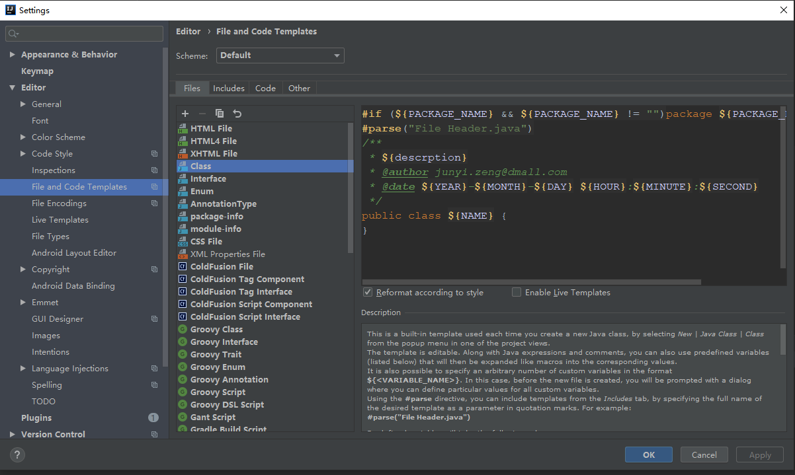
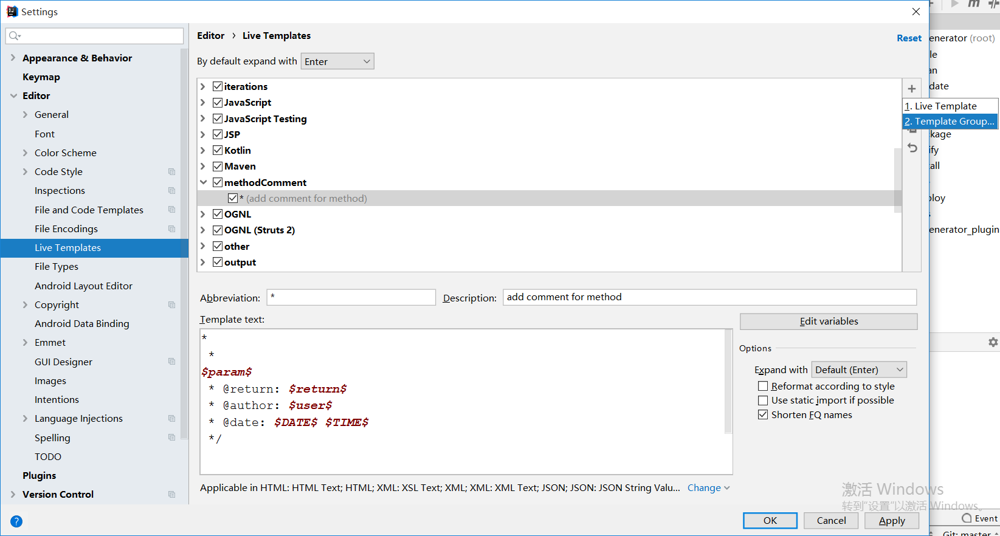
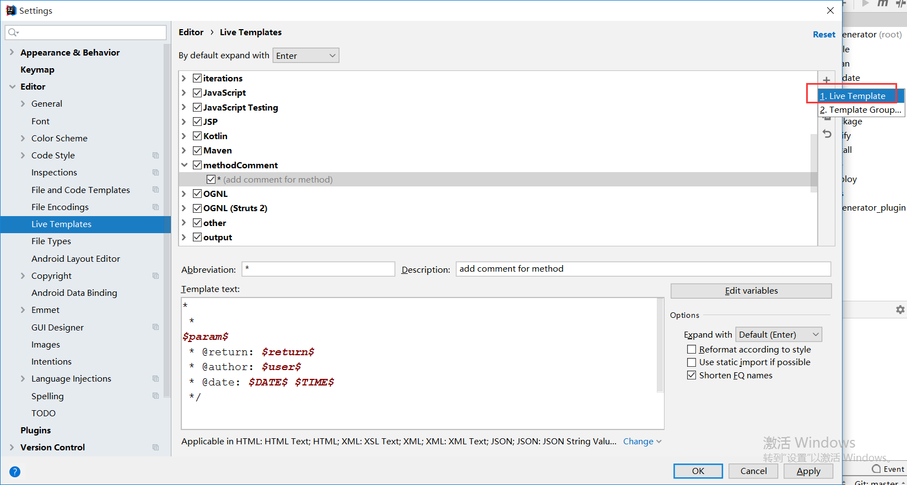
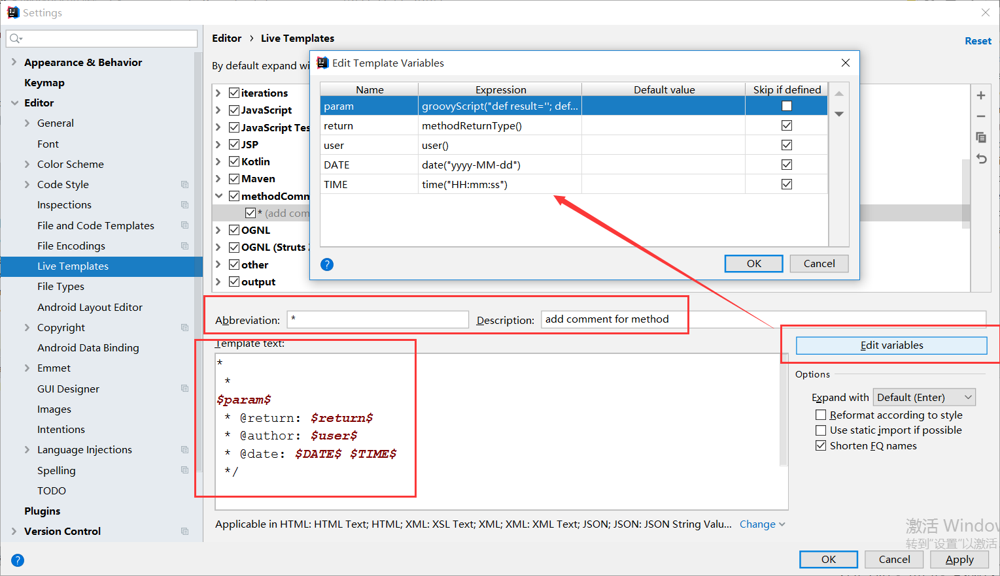
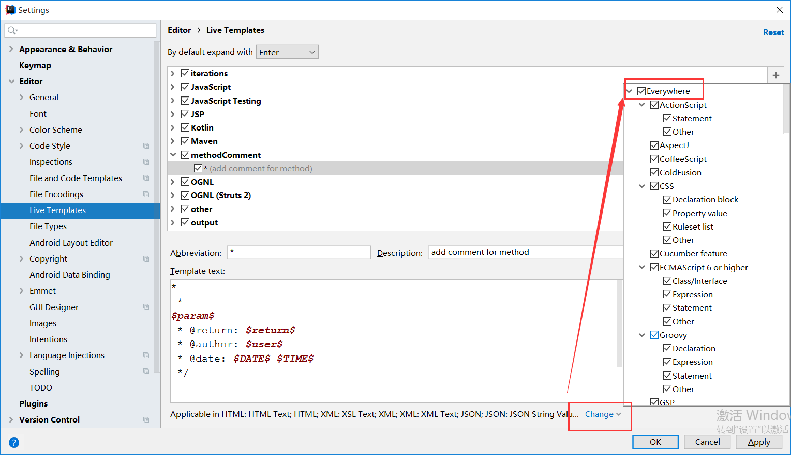

# 插件
- Free Mybatis plugin
- mybatis-log（Mybatis Log Plugin）
- Maven Helper
- RestfulToolkit
- String Manipulation
- SonarLint
- Alibaba Java Coding Guidelines
- Key promoter X
- Grep Console
- CheckStyle-IDEA
- FindBugs-IDEA
- Markdown Navigator
- Git Flow Integration
- GsonFormat
- POJO to JSON
- SequenceDiagram
- Iedis
- Translation
# 类注释
 
### 变量
- ${NAME}：类名
- ${USER}：用户
- ${DATE}：日期
- ${TIME}：时间
- ${YEAR}：年
- ${MONTH}：月
- ${DAY}：日
- ${HOUR}：时
- ${MINUTE}：分
- ${SECOND}：秒
- ${PROJECT_NAME}：项目名
# 方法注释
- 添加分组

- 添加模板

- 设置注释模板

- 注释模板
~~~ java
*
 * 
$param$
 * @return: $return$
 * @author: $user$
 * @date: $DATE$ $TIME$
 */
~~~
- 函数参数模板
~~~ js
groovyScript("def result=''; def params=\"${_1}\".replaceAll('[\\\\[|\\\\]|\\\\s]', '').split(',').toList(); for(i = 0; i < params.size(); i++) {result+=' * @param: ' + params[i] + ((i < params.size() - 1) ? '\\n' : '')}; return result", methodParameters())
~~~
- 设置应用范围
