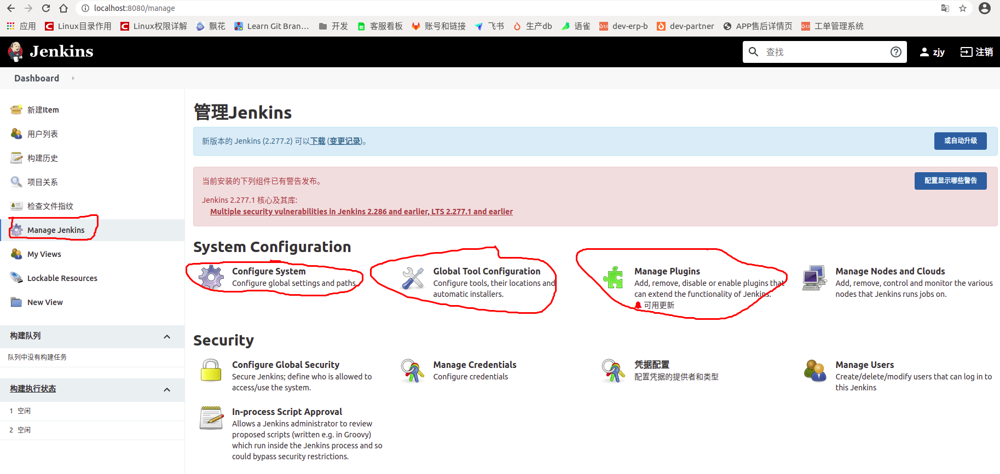
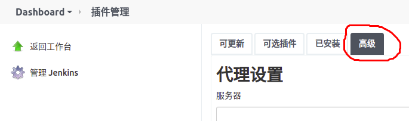
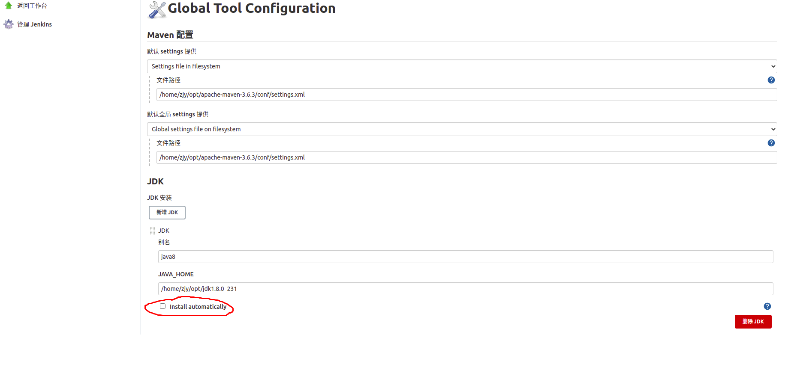
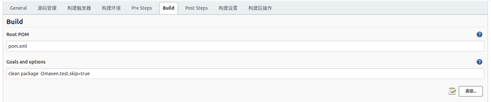
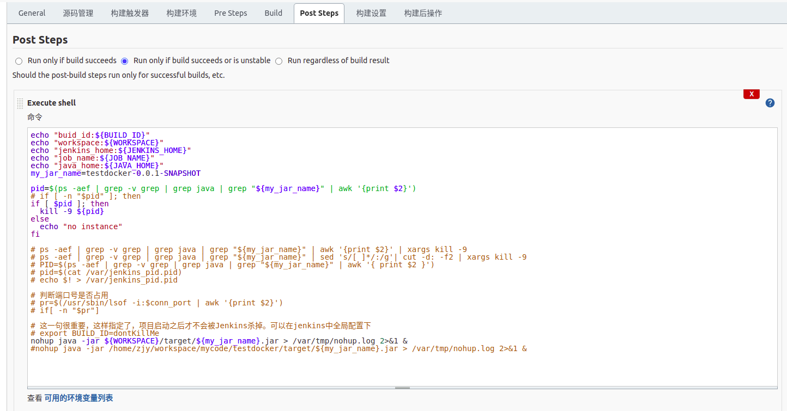
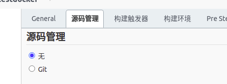
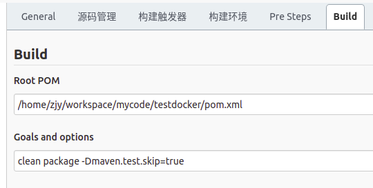

### 安装jenkins
``` shell
# 我们将存储库密钥添加到系统，添加密钥后，系统将返回OK
wget -q -O - https://pkg.jenkins.io/debian/jenkins-ci.org.key | sudo apt-key add -
# 将Debian包存储库地址附加到服务器的sources.list
echo deb http://pkg.jenkins.io/debian-stable binary/ | sudo tee /etc/apt/sources.list.d/jenkins.list
# 更新软件库
sudo apt-get update
# 安装jenkins，如果提示--allow-unauthenticated，则把此项添加到-y 后面，注意要添加空格，如果报错，看是不是java没有配置软链接到/usr/bin中
sudo apt-get install -y jenkins
# 报错，其中/opt/jdk1.8.0_231/bin/java是我本地java执行文件目录，或者检查8080端口是否被占用
sudo ln -s /opt/jdk1.8.0_231/bin/java /usr/bin/java
```

### 官网安装
```shell script
wget -q -O - https://pkg.jenkins.io/debian/jenkins.io.key | sudo apt-key add -
sudo sh -c 'echo deb http://pkg.jenkins.io/debian-stable binary/ > /etc/apt/sources.list.d/jenkins.list'
sudo apt-get update
sudo apt-get install jenkins
```

### 以管理员权限运行jenins，防止处理文件没有权限
```shell script
sudo vim /etc/default/jenkins
# 注意仅修改如下两个变量
JENKINS_USER=$NAME
JENKINS_GROUP=$NAME
# 改成
JENKINS_USER=root
JENKINS_GROUP=root
# 修改jenkins目录权限为root，此句可以先不执行，看报不报错
sudo chown -R root:root /var/lib/jenkins
# 重启服务
service jenkins restart

jenkins添加到root，下面操作可以先不处理，如果报错再试试
gpasswd -a jenkins root
```

### 启动jenkins
```shell script
# 启动服务
service jenkins start
# 停止
service jenkins stop
# 重启
service jenkins restart
# 配置jenkins
cat /var/lib/jenkins/secrets/initialAdminPassword
```

### maven插件设置
```shell script
# 设置升级站点
插件-->高级-->升级站点：https://mirrors.tuna.tsinghua.edu.cn/jenkins/updates/update-center.json
manage jenkins-->manage plugins-->可选插件-->Maven Integration
# 调整maven，在具体构建项目实例里配置
build-->高级，填写settings.xml路径
# 填写java_home
jdk-->新增jdk，注意自动安装不要勾选
# 添加全局变量，防止jenkins结束后自动关闭衍生进程，导致服务启不来
BUILD_ID=dontKillMe
```

### 添加maven项目
1. 填写git项目地址，如：https://github.com/chahongjing/testdocker.git 。指定构建分支，如master
2. 填写pom地址，如：pom.xml
3. 勾选构建job清理策略，如仅保留7天，最多保留5个构建。
4. 填写goals and options：clean package -Dmaven.test.skip=true
5. 填写构建后执行脚本，选择执行execute shell，注意，不要选择错了，如果是linux环境不要选择成window shell，然后添加脚本
### 执行脚本
```shell script
echo "buid_id:${BUILD_ID}"
echo "workspace:${WORKSPACE}"
echo "jenkins_home:${JENKINS_HOME}"
echo "job_name:${JOB_NAME}"
echo "java_home:${JAVA_HOME}"
my_jar_name=testdocker-0.0.1-SNAPSHOT

pid=$(ps -aef | grep -v grep | grep java | grep "${my_jar_name}" | awk '{print $2}')
# if [ -n "$pid" ]; then
if [ $pid ]; then
  kill -9 ${pid}
else
  echo "no instance"
fi

# ps -aef | grep -v grep | grep java | grep "${my_jar_name}" | awk '{print $2}' | xargs kill -9
# ps -aef | grep -v grep | grep java | grep "${my_jar_name}" | sed 's/[ ]*/:/g'| cut -d: -f2 | xargs kill -9
# PID=$(ps -aef | grep -v grep | grep java | grep "${my_jar_name}" | awk '{ print $2 }')
# pid=$(cat /var/jenkins_pid.pid)
# echo $! > /var/jenkins_pid.pid

# 判断端口号是否占用
# pr=$(/usr/sbin/lsof -i:$conn_port | awk '{print $2}')
# if[ -n "$pr"]

# 这一句很重要，这样指定了，项目启动之后才不会被Jenkins杀掉。可以在jenkins中全局配置下
# BUILD_ID=dontKillMe
# git构建
nohup java -jar ${WORKSPACE}/target/${my_jar_name}.jar > /var/tmp/nohup.log 2>&1 &
# 本地构建，这里写死了本地的构建目录
# nohup java -jar /home/zjy/workspace/mycode/testdocker/target/${my_jar_name}.jar > /var/tmp/nohup.log 2>&1 &
```

- jenkins配置


- 配置插件更新服务地址



- 全局配置maven和jdk




- 配置全局属性，此属性可以让jenkins构建结束后不自动结束部署的项目服务


- 构建项目配置，设置job清理策略和github


- 设置maven，点高级



- 设置执行脚本


- 本地代码构建，源代码选择无，且指定要执行的pom目录地址



