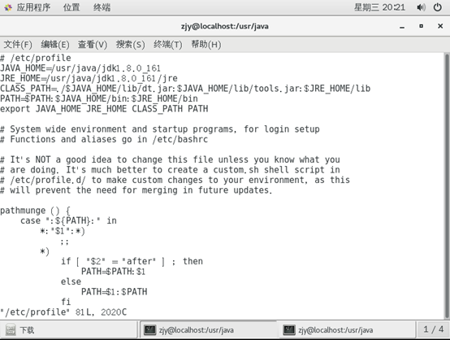

# Linux环境下部署java web程序
### 名词解释
1. Unix。是雏形。Linux的前身。
2. Linux。经过发展而来的，只是一个内核，并不是操作系统。Unix类比为满清王朝，linux就是现在的中国。
3. GNU。它的目标是创建一套完全自由的操作系统。我们现在常说的Linux系统其实是指的GNU/linux操作系统。GNU是“GNU is Not Unix”的递归缩写。
4. 	gcc。它是GNU编译器套件（GNU Compiler Collection）包括C、C++、Objective-C、Fortran、Java。
5. 详细[链接](https://blog.csdn.net/baidu_32134295/article/details/52439823)。
### 环境说明
1. 操作系统为vmware虚拟机+centos7 64位操作系统。
2. Web服务器为tomcat8，java虚拟机为jdk1.8。
3. 数据库为oracle 11gR2 64位。
4. redis 64位环境部署。
### 软件准备
1. 登录操作系统，在系统中下载jdk, tomcat, oracle, redis，或从本地复制到虚拟机中。
  - jdk-8u161-linux-x64.tar.gz 
  - apache-tomcat-8.5.29.tar.gz
  - linux.x64_11gR2_database_1of1.zip
  - linux.x64_11gR2_database_1of2.zip
  - redis-4.0.8.tar.gz 
 
 
2. 安装gcc
- 在命令行中输入yum install gcc进行安装。
### 软件安装
1. 解压jdk1.8, tomcat8, oracle, redis
2. 配置java环境变量。
  - 确定jdk解压后的目录如/usr/java/jdk1.8.0_161。
  - 通过vi编辑器配置环境变量，使用vi打开 /etc/profile,在前面输入如下内容，然后保存退出。 
 
  - 保存后输入java –version，看到类似如下信息便安装成功。 
 
3. 启动tomcat。进入tomcat的bin目录执行命令./startup.sh，关闭tomcat：./shutdown.sh。启动后可在浏览器中输入localhost:8080查看部署效果。
4. 安装redis
  - 进入解压目录并编译
~~~ cmd
$ cd redis-2.8.3
$ make
~~~
 
编译完成后，在Src目录下，有四个可执行文件redis-server、redis-benchmark、redis-cli和redis.conf(redis.config文件和src同级)。然后拷贝到一个目录下。
~~~ cmd
mkdir /home/zjy/redis
cp redis-server /home/zjy/redis
cp redis-benchmark /home/zjy/redis
cp redis-cli /home/zjy/redis
cp ../redis.conf /home/zjy/redis
cd /home/zjy/redis
~~~
  - 启动Redis服务。
~~~ cmd
$ ./redis-server redis.conf
~~~
  - 然后用客户端测试一下是否启动成功。
~~~ cmd
$ ./redis-cli
redis> set foo bar
OK
redis> get foo
"bar"
~~~
### 安装oracle
- 安装依赖
~~~ cmd
yum install -y binutils compat-gcc* compat-glibc* compat-libcap1 compat-libstd* compat-libstdc++-33 compat-libstdc++-33.i686 compat-libstdc++-33*.i686 elfutils-libelf elfutils-libelf-devel gcc gcc-c++ glibc glibc-common glibc-devel glibc-devel.i686 glibc-devel*.i686 glibc-headers glibc.i686 glibc*.i686 ksh libaio libaio-devel libaio-devel.i686 libaio-devel*.i686 libaio.i686 libaio*.i686 libgcc libgcc.i686 libgcc*.i686 libstdc++ libstdc++-devel libstdc++-devel*.i686 libstdc++.i686 libstdc++*.i686 libXp make numactl sysstat unixODBC unixODBC-devel unixODBC-devel*.i686 unixODBC*.i686
~~~
- 进入解压目录下的database，执行安装命令./runInstaller，注意大小写。执行完成后会启动图形化安装界面。安装和在window下一样。如果安装乱码，先执行export LANG=en_US.UTF-8，然后再安装。注意，在先决条件检测中，可能会有一些不通过的情况，按照网上的做法基本都能解决。如果不能解决，原因是操作系统中组件的版本过高，oracle检测版本过时导致，可忽略。
- 配置oracle环境变量
在用户目录下，如/home/zjy打开.bash_profile文件，通过ls可以看到些文件。添加如下配置，然后保存。重启系统。
~~~ cmd
export ORACLE_SID=orcl
export ORACLE_HOME=/home/zjy/app/zjy/product/11.2.0/dbhome_1
export PATH=$PATH:$ORACLE_HOME/bin
~~~
- 配置监听
在oracle_home/network/admin下找到listener.ora和tnsnames.ora文件修改配置。如下图 
 
 
- 启动服务
1. 在终端下输入sqlplus / as sysdba便可直接登录，如果提示命令未找到，则是环境变量未配置好或未生效。检查环境变量配置。登录后执行startup便可正常启动数据库实例。
2. 然后启动监听，使用lsnrctl start来启动监听（stop停止）启动时可能会提示实例unknow，可以忽略。看到最后成功字样，则监听启动成功，便可用普通用户登录了。如sqlplus zjy/1024@127.0.0.1:1521/orcl来登录。
### 部署war包
- 将war包复制到tomcat/webapps目录下，启动tomcat即可。注意修改war包中的配置文件信息。