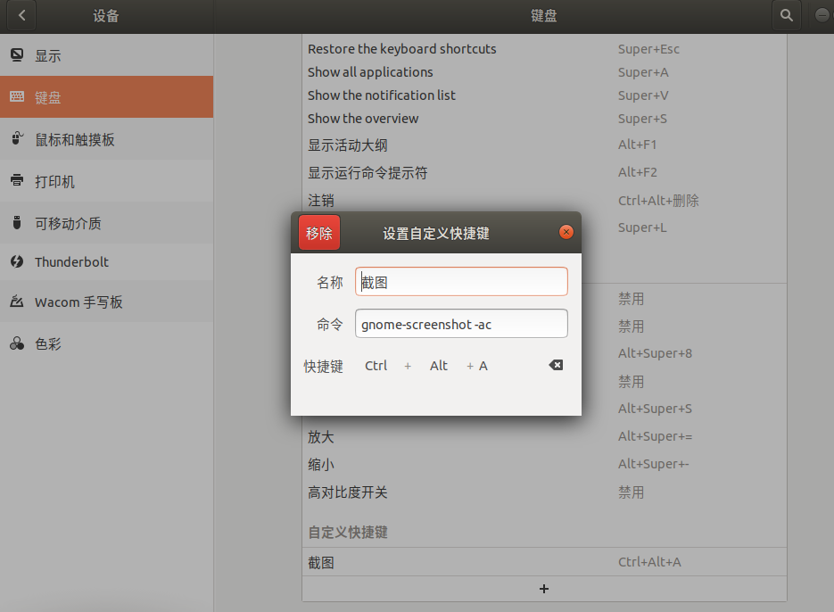

### apt
|apt 命令|取代的命令|命令的功能|
|---|---|---|
|apt install|apt-get install|安装软件包|
|apt remove|apt-get remove|移除软件包|
|apt purge|apt-get purge|移除软件包及配置文件|
|apt update|apt-get update|刷新存储库索引|
|apt upgrade|apt-get upgrade|升级所有可升级的软件包|
|apt autoremove|apt-get autoremove|自动删除不需要的包|
|apt full-upgrade|apt-get dist-upgrade|在升级软件包时自动处理依赖关系|
|apt search|apt-cache search|搜索应用程序|
|apt show|apt-cache show|显示装细节|
|apt list|/|列出包含条件的包（已安装，可升级等）|
|apt edit-sources|/|编辑源列表|

### 服务自启动
1. 复制启动脚本到指定目录：`sudo cp mystart.sh /etc/init.d`
2. 修改文件名称：`mv mystart.sh myservice`
1. 修改启动文件权限：`sudo chmod 755 myservice`
3. 加载服务程序：`systemctl daemon-reload`
2. 启动服务命令：`service myservice start`
3. 添加到自启服务命令：`update-rc.d -f myservice defaults`
4. 关闭服务命令：`service myservice stop`
5. 删除到自启服务命令：`update-rc.d -f myservice remove`

### 方式二
vim /usr/lib/systemd/system/nginx.service

Description=nginx - high performance web server
After=network.target remote-fs.target nss-lookup.target
[Service]
Type=forking
ExecStart=/usr/sbin/nginx -c /etc/nginx/nginx.conf
ExecReload=/usr/sbin/nginx -s reload
ExecStop=/usr/sbin/nginx -s stop
[Install]
WantedBy=multi-user.target


Description:描述服务
After:依赖，当依赖的服务启动之后再启动自定义的服务

[Service]服务运行参数的设置
Type=forking是后台运行的形式
ExecStart为服务的具体运行命令(需要根据路径适配)
ExecReload为重启命令(需要根据路径适配)
ExecStop为停止命令(需要根据路径适配)
PrivateTmp=True表示给服务分配独立的临时空间
注意：启动、重启、停止命令全部要求使用绝对路径

[Install]服务安装的相关设置，可设置为多用户

2.命令
systemctl disable nginx.service 关闭开机自启
systemctl enable nginx.service 开启开机自启
systemctl status nginx.service 查看状态
systemctl restart nginx.service 重启服务
systemctl list-units --type=service 查看所有服务
### 下载
启动aria2服务：`aria2c --daemon --enable-rpc=true`

### 连接到远程服务器：[命令方式见shell命令](https://github.com/chahongjing/CodeSummary/blob/master/linux/shell.md)
``` shell
ssh://dmadmin@10.248.224.871
```

### 添加阿里云镜像
1. 软件更新-->ubuntu software --> source code --> 填写：http://mirrors.aliyun.com/ubuntu

### 常用命令
|命令|说明|
|---|---|
|ctrl + a|光标移动到命令最前面|
|ctrl + e|光标移动到命令最后面|
|ctrl + y|粘贴|
|ctrl + u|删除光标前所有命令|

### 安装java软件
`apt install openjdk-8-jdk git maven nginx tomcat`

#### 设置截图
系统设置——>设备——>键盘——快捷键——自定义快捷键：`gnome-screenshot -ac`

