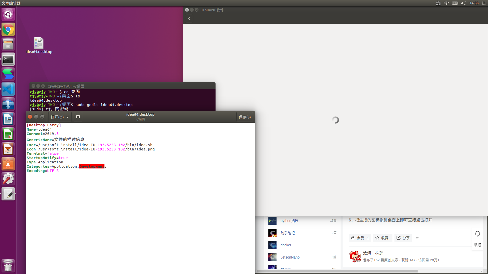
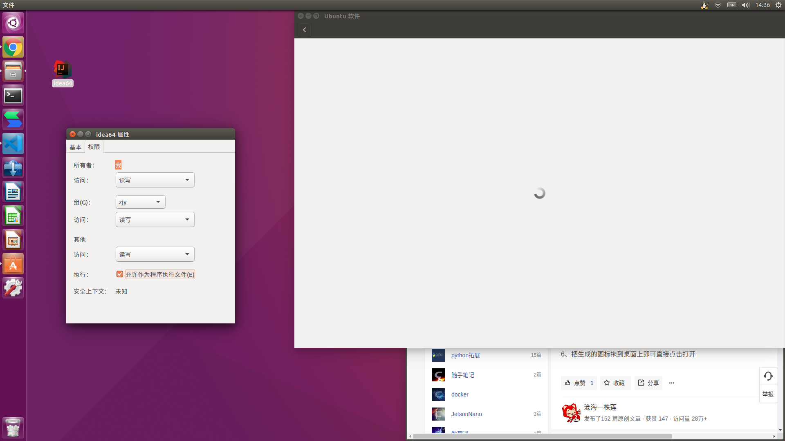

### 创建快捷方式
1. 在桌面添加快捷文件(xxx.desktop)，如idea64.desktop。

2. 编辑文件：sudo gedit idea64.desktop
~~~ ini
[Desktop Entry]
Name=idea64
Comment=2019.3
GenericName=文件的描述信息
Exec=/usr/soft_install/idea-IU-193.5233.102/bin/idea.sh
Icon=/usr/soft_install/idea-IU-193.5233.102/bin/idea.png
Terminal=false
StartupNotify=true
Type=Application
Categories=Application;Development;
Encoding=UTF-8
~~~
3. 给文件授权可执行权限：sudo chmod a+x idea64.desktop


3. 将启动图标添加到任务栏（收藏夹）
``` shell
sudo cp ~/桌面/idea.desktop /usr/share/applications
```