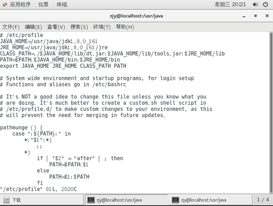

配置 jdk
1. 使用命令安装
``` shell script
sudo apt-get update
sudo apt install openjdk-8-jdk
```
2. 使用安装包安装。解压jdk.tar.gz文件。如/opt/jdk1.8.0_161。
3. 配置环境变量，sudo vim /etc/profile，在前面输入如下内容，然后保存退出<br>
~~~ shell
export JAVA_HOME=/opt/jdk1.8.0_161
export PATH=$PATH:$JAVA_HOME/bin
~~~
4. 配置完成后执行`source /etc/profile`命令生效
<br>
5. 系统注册jdk。`sudo update-alternatives --install /usr/bin/java java /usr/lib/jvm/jdk1.8.0_191/bin/java 300`
- 保存后输入java –version，看到类似如下信息便安装成功。<br>
<br>
- 启动tomcat
~~~ cmd
./startup.sh，关闭项目：./shutdown.sh
~~~
### 修改java默认版本
`sudo update-alternatives --config java`
