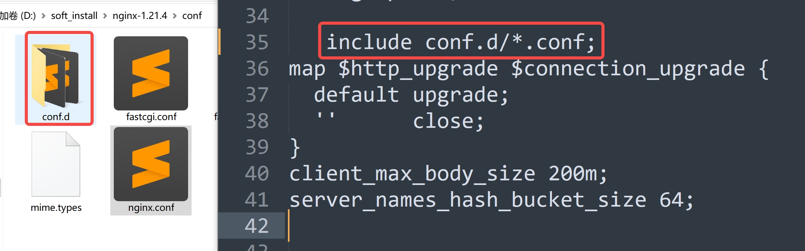
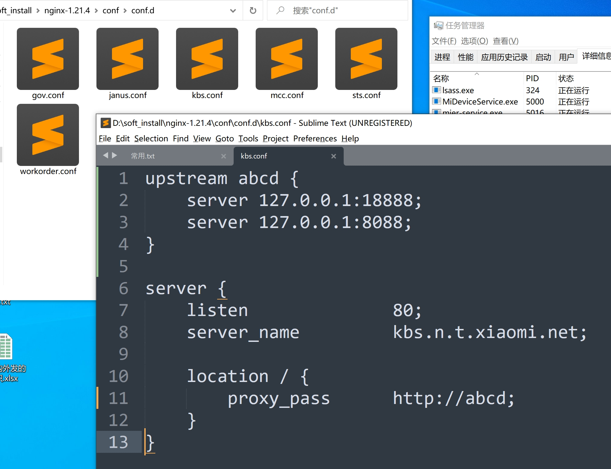

# nginx
``` cmd
rem 启动nginx，注意启动后不能直接关闭cmd，这样nginx进程不会结束，会导致个性配置文件后不生效。要用下面的命令关闭nginx
start nginx
rem 
nginx -c /path/to/nginx.conf
rem 修改配置后重新加载生效
nginx -s reload
rem 重新打开日志文件
nginx -s reopen
rem 测试nginx配置文件是否正确
nginx -t -c /path/to/nginx.conf

rem 快速停止nginx
nginx -s stop
rem 完整有序的停止nginx
nginx -s quit
rem 其他的停止nginx 方式：
ps -ef | grep nginx
rem 从容停止Nginx
kill -QUIT 主进程号
rem 快速停止Nginx
kill -TERM 主进程号
rem 强制停止Nginx
pkill -9 nginx

rem 平滑重启nginx
kill -HUP 主进程号
```
### 负载均衡节点配置
1. 在http节点下配置服务结点，mynodes为自定义名称，在第二步中要与这个名字保持一致
``` ini
upstream mynodes {
    server              127.0.0.1:20000;
    server              127.0.0.1:20001;
}
```
2. 在http --> server --> location节点下添加`proxy_pass http://mynodes;`。其中mynodes要和上面配置的节点名称一致
```ini
location / {
    root                html;
    index               index.html index.htm;
    proxy_pass          http://mynodes; 
}
```
3. 以上配置完成后nginx会监听http --> server中listen端口的请求自动转到mynodes下面的节点中的一个进行负载均衡。
### 多域名映射多节点配置
1. 在配置文件nginx.conf所在目录添加domain文件夹，在nginx.conf文件中http节点下添加`include conf.d/*.conf;`注意末尾的分号。

2. 进入domain文件夹下，添加对应配置文件。内容如下

``` nginx
upstream serviceIdentifyName {
    server              127.0.0.1:21002;
}

server {
    listen              80;
    server_name         dev.your.domain.com;
    charset             utf-8;

    location / {
        root            html;
        index           index.html index.htm;
        proxy_pass      http://serviceIdentifyName; 
    }
    error_page          500 502 503 504  /50x.html;
    location = /50x.html {
        root            html;
    }
}


# 取名字配置
upstream justAName {
    server              127.0.0.1:8543;
}

server {        
    listen 80;
    server_name         jr.kefu.local.com;
    charset             utf-8;

    location / {
        proxy_buffer_size       64k;
        proxy_buffers           32 32k;
        proxy_busy_buffers_size 128k;
        proxy_pass              http://justAName/;
        proxy_set_header        Host $host;
        proxy_http_version      1.1;
    }
}


# 直接配置
server { 
    listen              80; 
    server_name         wou.local.kefu.com;
    charset             utf-8;
        
    location / { 
        proxy_pass      http://wou.local.kefu.com:8686/;
    } 
}

# 静态网站配置
server { 
    listen              80; 
    server_name         sts.com;
    charset             utf-8;
     
    location / { 
        root            D:/sts_page/;
        autoindex       on;
    } 
}
```
同一域名转发不同服务
```  nginx
server { 
    listen              80; 
    server_name         www.zjy.com;
    charset             utf-8;
        
    location /contextA { 
        proxy_pass      http://www.zjy.com:8041/contextA; 
    } 

    location /contextB { 
        proxy_set_header Host $host; 
        proxy_pass      http://www.zjy.com:8695/contextB; 
    } 

    location /contextC/test { 
        proxy_pass      http://192.168.0.0.2:8089/contextC/test/getExtension; 
    } 

    location /mst/ngs/ { 
        add_header              Access-Control-Allow-Origin *; 
        proxy_set_header        Host $host; 
        proxy_set_header        X-Forwarded-For $remote_addr; 
        proxy_pass              http://www.zjy.com/ngs/; 
        proxy_cookie_path       /ngs /; 
    } 
}
```
### 在http节点中添加其它配置
``` ini
# 加载nginx.conf文件目录下的domains目录下所有.conf结尾的配置文件
include                         conf.d/*.conf;
# 上传文件缓冲区大小
client_max_body_size            20M;
# 请求信息大小限制（如上传）,注意末尾的分号不能遗漏。
client_body_buffer_size         20M;
# 解决启动报错误：could not build server_names_hash, you should increase server_names_hash_bucket_size: 32
server_names_hash_bucket_size   64;
```

### 配置https转本地http
```shell script
如下脚本https://rd-workordernw-partner.zjy.com会转到本地21021端口服务
upstream rd-workordernw-partner.zjy.com {
    server              127.0.0.1:21021;
}

server {
    listen              443 ssl;
    server_name         rd-workordernw-partner.zjy.com;
    charset             utf-8;

    ssl_certificate     C://ssl//buduhuisi.crt;
    ssl_certificate_key C://ssl//buduhuisi.key;

    location / {
        root            html;
        index           index.html index.htm;
        proxy_pass      http://rd-workordernw-partner.zjy.com; 
    }
    error_page          500 502 503 504  /50x.html;
    location = /50x.html {
        root            html;
    }
}
```
[nginx配置https](https://www.cnblogs.com/chasewade/p/7661290.html)
