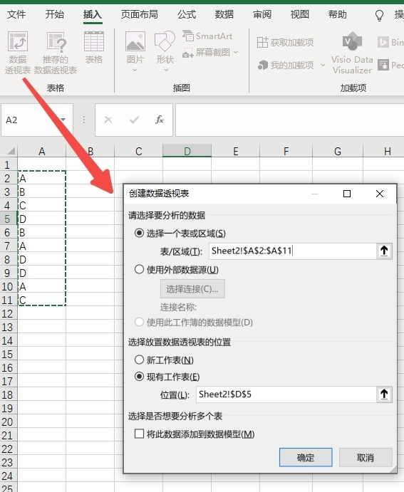
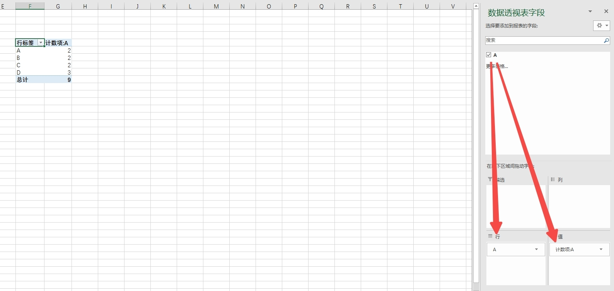
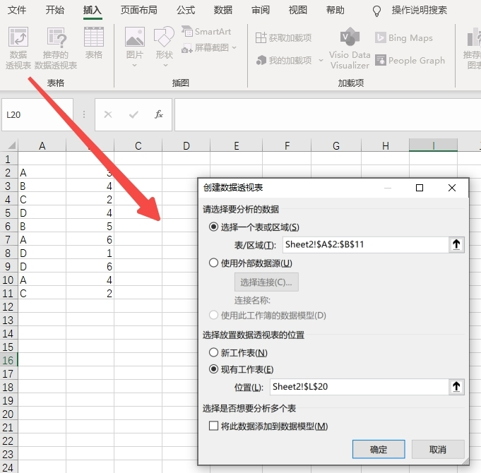
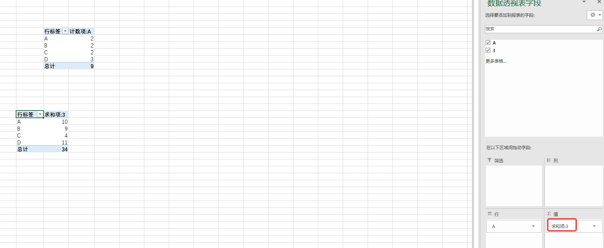
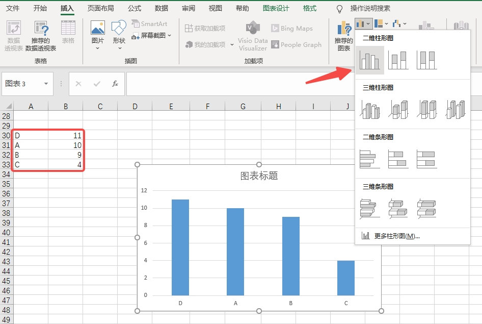
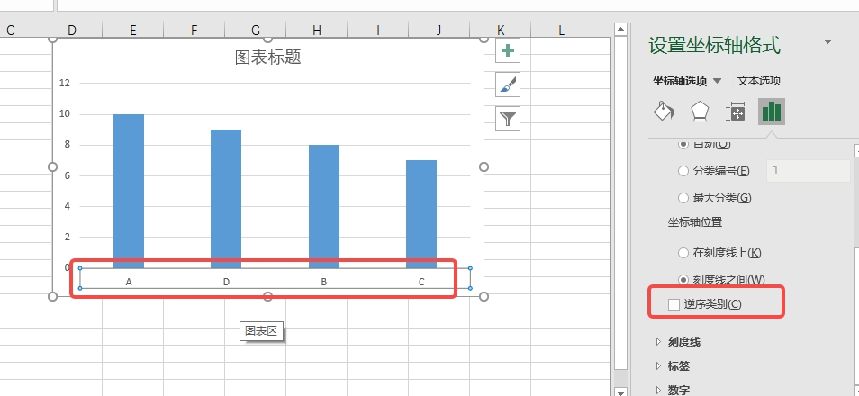
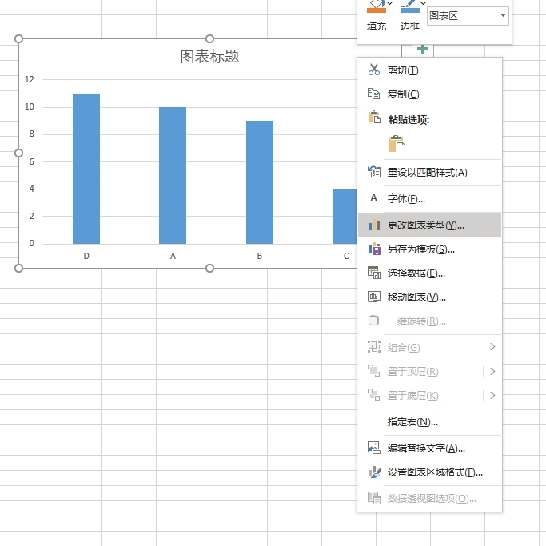

1. 两个时间相减`=TEXT(A2-A1,"[s]")`。h是小时，m是分钟，s是秒
2. 两个时间相减`=DATEDIF(A2,B2,"y")`。y是年，m是月，d是天
3. 两个sheet数据匹配`=VLOOKUP(A:A,Sheet2!A:B,2,0)`，其中第三个参数表示返回第几列数据，索引从1开始

5. 单元格内容合并`=CONCATENATE(A4,";",B4,";",C4)`

### 对数据出现次数统计或求和
1. 插入数据透视表，选择一个表或区域为选择你要统计的数据列，如下图就是A列中的数据，数据存放位置可以选择一个空白的位置即可

2. 选择统计列和统计类别，类别为计数项，如果没有自动生成，则可以将上面的列拖下来

3. 同上统计次数，不同的是选择数据区域为多列数据

4. 设置列时，类别选择为求和

### 对数据统计生成柱状图
1. 对数据先排序，然后选中数据区域，点击插入，选择柱状图

2. 选择横坐标，可以更改排序

2. 选择图表可以切换到其它图片，如横向排列
